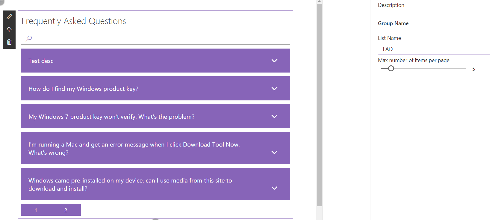

## Using React Accordion plugin with SPFx

## Summary

This is a sample web Part that illustrates the use of React Accessible Accordion plugin for building SharePoint Framework client-side web parts to show SharePoint list data in Accordion format.

## Used SharePoint Framework Version 

## Applies to

* [SharePoint Framework Developer Preview](http://dev.office.com/sharepoint/docs/spfx/sharepoint-framework-overview)
* [Office 365 developer tenant](http://dev.office.com/sharepoint/docs/spfx/set-up-your-developer-tenant)

## Solution

Solution|Author(s)
--------|---------
react-accordion | Gautam Sheth (SharePoint Consultant, RapidCircle)

## Version history

Version|Date|Comments
-------|----|--------
1.0|August 17, 2018|Initial release

## Disclaimer
**THIS CODE IS PROVIDED *AS IS* WITHOUT WARRANTY OF ANY KIND, EITHER EXPRESS OR IMPLIED, INCLUDING ANY IMPLIED WARRANTIES OF FITNESS FOR A PARTICULAR PURPOSE, MERCHANTABILITY, OR NON-INFRINGEMENT.**

---

## Minimal Path to Awesome

- clone this repo
- in the command line run:
  - `npm i`
  - `gulp serve --nobrowser`
- in your SharePoint Site create a custom list named FAQ 
- in the FAQ list, create a column Description(internal name) of type Enhanced rich text
- add some list items with Title and Description values

- navigate to the hosted version of SharePoint workbench, eg. **https://contoso.sharepoint.com/sites/test/_layouts/15/workbench.aspx**
- add the Web Part to canvas and in its configuration specify:
- name of the list where list items are stored, eg. **FAQ**

## Features

This project contains sample client-side web part built on the SharePoint Framework illustrating how to show list data in Accordion format using React framework.

This sample illustrates the following concepts on top of the SharePoint Framework:

- general
  - performing SharePoint GET operation in React using inbuilt SP Http Client
  - Using Fabric UI button component for pagination      
  - optimizing REST responses for performance using nometadata option of JSON light
  - using PnP Webpart title control of @pnp/spfx-controls-react library
  - showing SharePoint list data in Accordion format using React Accessible Accordion plugin
  - searching in the fetched data by making use of Search Box from Office Fabric UI

